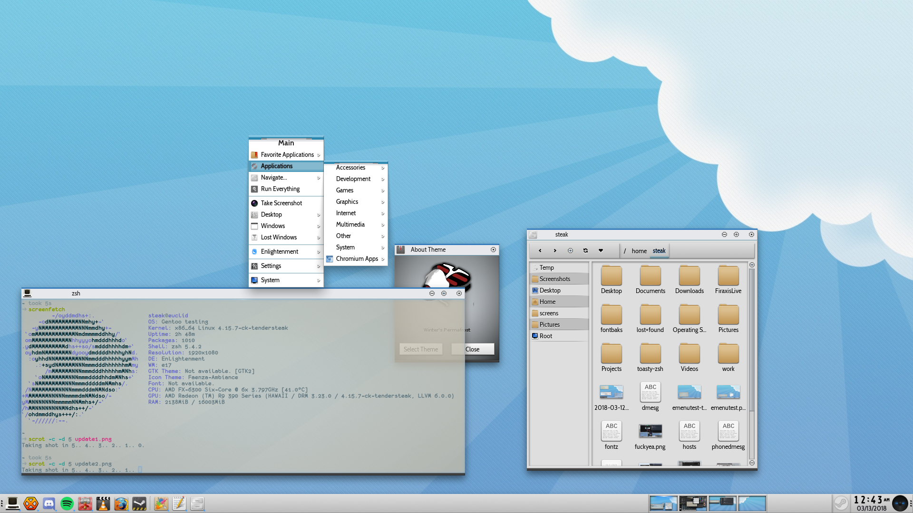

# tundra-e22
A homage to my favorite theme for anything ever, Winter. (E16's default and briefly around for E17) Winter was originally made by Rephorm ... like 20 years ago oh god why did I say that?

Because the fellas in #e are probably sick of me whining that I want the Winter theme back, I decided to take a stab at something like it myself. Originally, I wanted to simply port the E17 version of Winter to E22. I wasn't able to decompile the copies of the E17 version of Winter, however. The last update to that theme was in 2007. The EFL has outgrown it, and the theme cannot be decompiled with current versions of EFL.

So here we are, and this is the result of a single manic night glued to gimp and vim. There aren't a ton of theme options for E, and I haven't made one since E17 was the new hotness. I am pretty pleased with how this is turning out so far. But who knows what'll come of it. Anyway, this is wildly incomplete, but I'm putting it up here so we can all use it. 

I have torn apart the Neptune theme for E21 and laid it as the foundation of this theme. That theme can be found at [enlightenment-themes.org](https://www.enlightenment-themes.org/p/1171453/) . I chose it for no particular reason, other than it was already a light color scheme. Nice theme though. Still works pretty well in E22, if you want to check it out.

Don't mind the fonts, I did all this work on my laptop, whose arch install was met by my inept configuration of fontconfig. Updated shots with higher resolution and wildly improved font rendering will come later. :) Head over to the releases page for the first demo of it, and be sure to report any issues or ideas. :D
